# invoice-mlops

End-to-end MLOps platform on Google Cloud for invoice processing: a **risk-scoring model** that decides whether an invoice needs manual review (Engine A), and an **LLM field-extraction module** (Engine B, in progress). The focus is the ML lifecycle around the model rather than the model itself: validated inputs, a metric-gated training pipeline, CI/CD, canary releases with rollback, and prediction logging for monitoring.

Everything runs in `europe-west4` and the infrastructure is managed with Terraform from day 0.

## Architecture

```mermaid
flowchart LR
    subgraph CI["CI/CD · Cloud Build"]
        PR["Pull request<br/>unit tests + pipeline compile"]
        MAIN["Merge to main<br/>test → build → push → deploy"]
    end

    subgraph TRAIN["Training · Vertex AI Pipelines (KFP)"]
        T["train<br/>XGBoost container"] --> E{"evaluate<br/>F1 ≥ min_f1?"}
        E -- fail --> A["Pub/Sub alert"]
    end

    subgraph SERVE["Serving · Cloud Run"]
        S["stable revision<br/>80%"]
        C["canary revision<br/>20%"]
    end

    GCS[("GCS<br/>data + model artifacts")]
    BQ[("BigQuery<br/>prediction log")]

    MAIN --> SERVE
    MAIN -- submits --> TRAIN
    GCS --> T
    E -- pass --> GCS
    GCS -- MODEL_URI --> SERVE
    CLIENT(["POST /score"]) --> SERVE
    SERVE -- Pandera-validated input,<br/>score, latency, model version --> BQ
```



## What's implemented

| Area | Implementation |
|---|---|
| **Data** | Synthetic invoice dataset (400 invoices, 40 vendors) with rule-bootstrapped labels and 8% label noise. See the [model card](docs/model_card.md) for its limits. |
| **Model** | XGBoost binary classifier on 6 features: `amount`, `lines_sum`, `hour`, `is_new_vendor`, `vendor_avg_amount`, `amount_vs_avg_ratio`. No identifiers are used as features. |
| **Serving** | FastAPI `/score`, `/health`, `/version`. Multi-stage Docker image. The model is loaded from GCS through `MODEL_URI` (a Secret Manager secret), so it isn't baked into the image. |
| **Input validation** | Pandera schema (ranges, types, allowed values). Invalid payloads get a `422` before reaching the model. |
| **Prediction logging** | Every prediction is written to BigQuery with its features, score, model version and latency. This is the base for drift monitoring. |
| **Training pipeline** | Vertex AI Pipelines (KFP v2): containerized `train` → `evaluate` gate (`F1 ≥ min_f1`). An `ExitHandler` publishes a Pub/Sub alert if any step fails. Parametrized (data URI, hyperparameters, threshold). |
| **CI/CD** | Cloud Build. On PR it runs unit tests and compiles the pipeline. On merge to `main` it runs the tests, builds and pushes to Artifact Registry, deploys to Cloud Run and submits the staging pipeline run. |
| **Releases** | Cloud Run traffic split: canary at 20%, and a one-command rollback to the stable revision with no rebuild (`scripts/rollback.sh`). See the [runbook](docs/runbook.md). |
| **Infra & security** | Terraform for buckets, the service account and IAM. The workload runs as a dedicated service account with no JSON key, and the model URI is stored in Secret Manager. |

## Numbers

Load test with `hey -n 200 -c 10` against `POST /score`, during a 80/20 canary split. Latency is per revision, taken from Cloud Logging:

| Revision | Requests | 5xx | p50 | p95 |
|---|---|---|---|---|
| stable | 157 | 6 (3.8%) | 277 ms | 659 ms |
| canary | 43 | 0 | 105 ms | 323 ms |

All the 5xx errors came from cold starts, because the service runs with `min-instances=0` to keep cost near zero. Client-side p95 including cold starts was 10.3 s. Setting `min-instances=1` is the next step for a latency-sensitive setup.

## Roadmap

A 16-week build. Weeks 0–10 are done.

- [x] Synthetic data, XGBoost baseline, FastAPI + Docker
- [x] Model loaded from GCS, Cloud Build CI/CD to Cloud Run
- [x] Pandera validation + BigQuery prediction logging
- [x] Vertex AI pipeline with metric gate, Pub/Sub alerting, PR checks
- [x] Canary at 20% + rollback without rebuild
- [ ] Vertex AI Model Registry + threshold-gated promotion
- [ ] Daily drift detection (PSI / KS) on the BigQuery log → alert → retraining trigger
- [ ] Engine B: Gemini structured extraction, evaluated per field against a gold set (`data/gold/`)
- [ ] Architecture and cost docs, Terraform coverage for all resources

## Repository layout

```
src/api/        FastAPI scoring service
src/train/      training entrypoint (container used by the pipeline)
src/eval/       promotion gate
src/features/   synthetic dataset generator
src/extract/    Engine B (LLM extraction), in progress
pipelines/      KFP pipeline definition + staging submit
infra/          Terraform
scripts/        operational scripts (rollback)
tests/          unit tests (gate, request schema, input validation)
docs/           model card, runbook, architecture, cost
```

## Run locally

```bash
pip install -r requirements.txt
python src/features/generate_dataset.py      # data/invoices.csv
python src/train/train.py                     # models/model.joblib + metrics.json
uvicorn src.api.main:app --port 8080
PYTHONPATH=. pytest -q
```

Locally the API loads `models/model.joblib`. Prediction logging needs GCP credentials with access to the BigQuery table.
